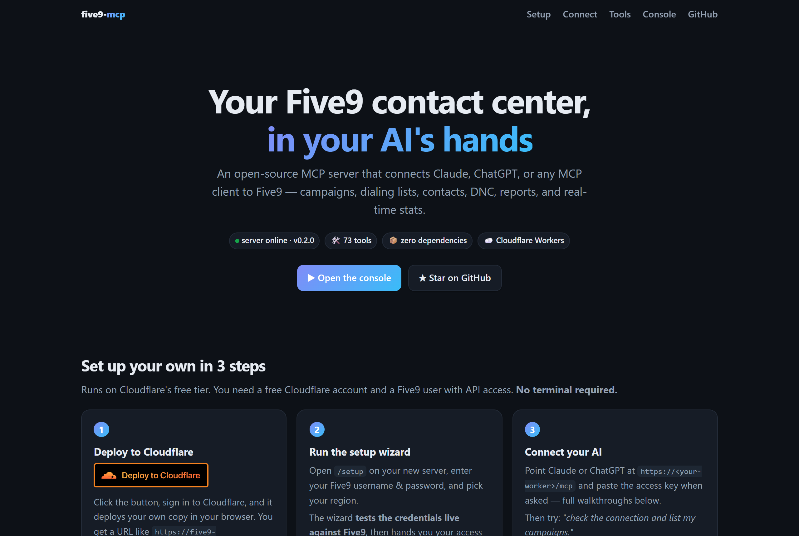
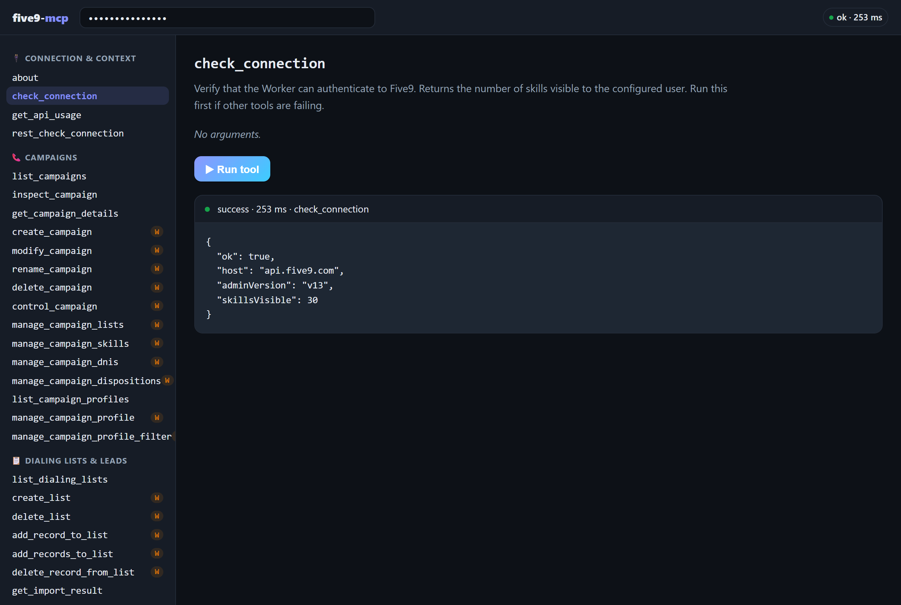
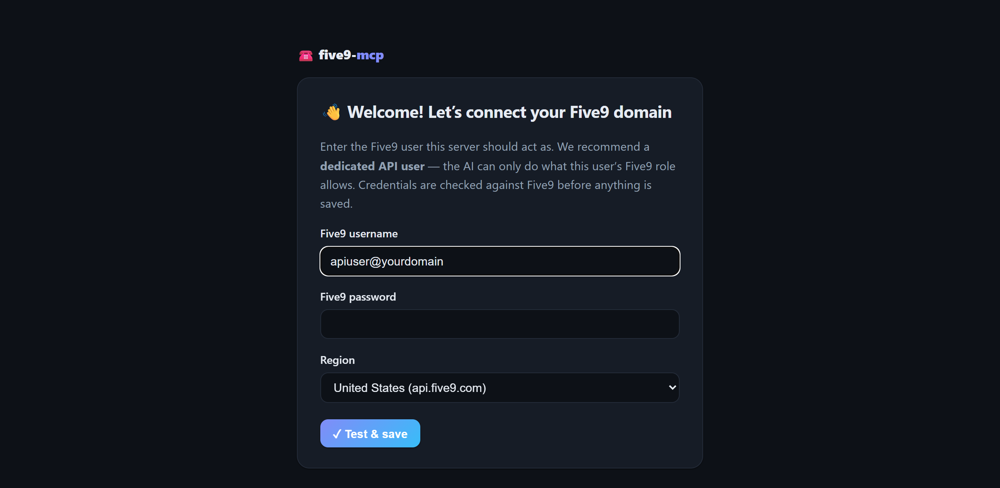

<div align="center">

# ☎️ five9-mcp

**Your Five9 contact center, in your AI's hands.**

An open-source [MCP](https://modelcontextprotocol.io) server that connects Claude, ChatGPT, or any MCP client to the **Five9** cloud contact center — running on **Cloudflare Workers** with **zero dependencies**.

[](LICENSE)
[](https://workers.cloudflare.com)
[](package.json)
[](https://modelcontextprotocol.io)
[](#-the-toolbox)

[Quick start](#-quick-start--no-terminal-needed) · [Connect Claude](#connect-claude-web--desktop) · [Connect ChatGPT](#connect-chatgpt) · [Tools](#-the-toolbox) · [Architecture](#%EF%B8%8F-architecture)



</div>

---

Ask your AI things like:

> *"Who's on a call right now, and how deep is the sales queue?"* 📊
> *"Create a preview campaign for the win-back list, attach the sales skill, and start it."* 🛠️
> *"Stop the OUTBOUND_AGED campaign and add these 3 leads to the callback list."* 📞
> *"Onboard the new agent: create the user, assign the billing skill at level 2."* 🧑‍💼
> *"Is 555-867-5309 on our DNC? Check before anyone dials it."* 🚫
> *"Pull yesterday's Call Log report and summarize abandon rates."* 📈
> *"Build me a complete IVR: option 1 scheduling, option 2 billing, after hours goes to voicemail."* 🧩

Under the hood, this server speaks Five9's Configuration (admin) and Statistics (supervisor) **SOAP Web Services** — the APIs that still run Five9's admin surface — and exposes them as clean JSON tools over MCP streamable HTTP. Hand-rolled envelopes, a ~60-line XML parser, no npm packages. Every tool has been exercised against a live Five9 domain.

## ✨ Built-in web UI

Deploy it and your Worker serves more than an API:

| Page | What you get |
|------|--------------|
| `/` | A polished landing page: live server status, this setup guide, click-by-click AI connection walkthroughs, and the full tool catalog |
| `/setup` | The **setup wizard** — enter Five9 credentials in your browser, get them verified live, receive your access key. No terminal, no secrets commands |
| `/console` | An **interactive console** — paste your access key, pick any of the 77 grouped tools, fill a form generated from its schema, and run it against your live Five9 domain right from the browser |
| `/mcp` | The MCP endpoint itself (streamable HTTP, stateless) |
| `/health` | JSON healthcheck |

The console is the fastest way to sanity-check credentials, explore what each tool returns, or debug a campaign — no AI required.

<div align="center">

<br><em>The console running <code>check_connection</code> against a live Five9 domain</em>
</div>

## 🚀 Quick start — no terminal needed

You need a free Cloudflare account and a Five9 user with API access — **create a dedicated Five9 API user** scoped to what you want an AI to do, don't reuse a personal admin login.

**1 — Deploy to Cloudflare** *(one click, in your browser)*

[](https://deploy.workers.cloudflare.com/?url=https://github.com/saboor650/fixpath-five9-mcp)

Sign in to Cloudflare and click through — it creates your own copy of this Worker (plus the KV namespace it needs) and gives you a URL like `https://five9-mcp.you.workers.dev`.

**2 — Run the setup wizard** *(in your browser)*

Open **`/setup`** on your new server. Enter your Five9 username, password, and region — the wizard **verifies them live against Five9** before saving, then hands you your **access key** (shown once — store it in a password manager).

<div align="center">

</div>

**3 — Connect your AI** (walkthroughs below), then ask it to *"check the connection and list my campaigns."* 🎉

<details>
<summary><strong>⌨️ Prefer the CLI?</strong></summary>

```sh
git clone https://github.com/saboor650/fixpath-five9-mcp
cd five9-mcp
npx wrangler deploy   # provisions the CONFIG KV namespace on first deploy
```

Then either use the `/setup` wizard, or skip it and manage credentials as Wrangler secrets (secrets override the wizard):

```sh
npx wrangler secret put FIVE9_USERNAME   # e.g. apiuser@yourdomain
npx wrangler secret put FIVE9_PASSWORD
npx wrangler secret put MCP_AUTH_TOKEN   # a long random string — this is the key to your server
```

</details>

<details>
<summary><strong>🌍 Non-US domain or different API version?</strong></summary>

Defaults live in `wrangler.toml` and work for US domains:

| Var | Default | Notes |
|-----|---------|-------|
| `FIVE9_API_HOST` | `api.five9.com` | EU: `api.eu.five9.com` · Canada: `api.ca.five9.com` |
| `FIVE9_ADMIN_VERSION` | `v13` | Config Web Services WSDL version |
| `FIVE9_SUPERVISOR_VERSION` | `v13` | Statistics Web Services WSDL version |

</details>

## 🔌 Connect your AI

### Connect Claude (web & desktop)

Custom connectors are available on Free (one connector), Pro, Max, Team, and Enterprise plans.

1. In [claude.ai](https://claude.ai) or the Claude desktop app, open **Settings → Connectors**.
2. Click **Add custom connector**.
3. Name it **Five9** and paste your server URL **including the `/mcp` path**:
   `https://<your-worker>.workers.dev/mcp`
4. Click **Add**, then **Connect**. Claude auto-discovers this server's built-in OAuth and opens its authorization page.
5. On the **🔐 five9-mcp** screen, paste your `MCP_AUTH_TOKEN` as the access key and click **Authorize**.
6. In any chat, open the **search & tools** (＋) menu and make sure the Five9 connector is toggled on.

> **Team/Enterprise:** an Owner first adds the connector under **Organization settings → Connectors**; members then click **Connect** in their own settings to authorize.

### Connect ChatGPT

Custom MCP connectors require **Developer mode** (Plus/Pro; on Business/Enterprise an admin must allow custom connectors).

1. In [ChatGPT](https://chatgpt.com) on the web, open **Settings → Apps & Connectors** (sometimes labeled just **Connectors**).
2. Under **Advanced settings**, toggle **Developer mode** on.
3. Back on the Connectors page, click **Create**.
4. Name it **Five9**, set the **MCP server URL** to `https://<your-worker>.workers.dev/mcp`, and choose **OAuth** authentication.
5. Acknowledge the trust prompt and save. ChatGPT opens this server's authorization page — paste your `MCP_AUTH_TOKEN` and click **Authorize**.
6. In a new chat, open the ＋ / tools menu and enable the **Five9** connector (Developer mode connectors are enabled per-conversation). ChatGPT asks you to confirm each tool call — sensible for anything that can start a dialer. 😄

### Connect Claude Code

```sh
claude mcp add --transport http five9 https://<your-worker>.workers.dev/mcp \
  --header "Authorization: Bearer <your MCP_AUTH_TOKEN>"
```

The raw access key works directly as a bearer token — no OAuth dance. Run `/mcp` inside Claude Code to verify.

### Any other MCP client

Anything that speaks MCP **streamable HTTP** works — complete the OAuth flow or send the access key as a bearer token:

```sh
curl -X POST https://<your-worker>.workers.dev/mcp \
  -H "Authorization: Bearer <MCP_AUTH_TOKEN>" \
  -H "Content-Type: application/json" \
  -d '{"jsonrpc":"2.0","id":1,"method":"tools/call","params":{"name":"check_connection","arguments":{}}}'
```

<details>
<summary><strong>🔐 How the built-in OAuth works</strong></summary>

`src/oauth.js` implements a minimal OAuth 2.1 authorization server (metadata discovery, dynamic client registration, PKCE S256, refresh tokens) designed for a **single-operator** deployment:

- The "login" on the consent screen is the server's access key (`MCP_AUTH_TOKEN`).
- Everything is stateless — client IDs, auth codes, and tokens are HMAC-SHA256-signed blobs keyed by `MCP_AUTH_TOKEN`. No KV, no Durable Objects.
- Both auth paths work simultaneously: OAuth-minted tokens *and* the raw key as a bearer credential.
- Revoke everything at once by rotating the secret: `npx wrangler secret put MCP_AUTH_TOKEN`.

</details>

## 🧰 The toolbox

**82 tools.** 🟢 = read (always safe) · ✏️ = write (changes your domain — the server tells AIs to confirm with you first)

> 74 SOAP tools (username/password) + 8 OAuth New Platform REST tools (Consumer Key/Secret — see [OAuth New Platform APIs](#-oauth-new-platform-apis)).

<details open>
<summary><strong>🧩 IVR builder — whole call flows from plain English</strong></summary>

The headline trick: describe a call flow in a paragraph and the AI designs it, shows you a **Mermaid diagram in chat**, and deploys a working IVR script. The model never freestyles Five9's IVR XML: it fills a constrained JSON flow spec (play / menu / business-hours / skill transfer / voicemail / hangup, plus the routing nodes **lookup_contact / if_else / agent_transfer / third_party_transfer** for CRM-driven flows such as "send the caller back to the last agent who spoke with them"), a graph validator checks every branch and reference, and deterministic code emits designer-shaped XML (module wiring, prompt encoding, and field order all derived from real exported scripts).

| | Tool | What it does |
|--|------|--------------|
| 🟢 | `validate_ivr_flow` | Graph-check a flow spec + verify referenced skills/prompts exist on the domain |
| 🟢 | `render_ivr_flow` | Render a flow spec **or an existing IVR script** as a Mermaid flowchart |
| ✏️ | `build_ivr_script` | Compose the full script XML and create it on the domain (`dry_run` to inspect first) |
| 🟢 | `list_ivr_modules` | Inventory of an existing script: every module, its type, and its wiring resolved to module **names** (menu keys → targets, transfer numbers, prompts, agent-transfer variables, if/else conditions) |
| ✏️ | `patch_ivr_script` | Surgical edits to an existing script by module name — change a transfer number, swap a prompt, retarget/add/remove a menu key, change an if/else condition, the agent-transfer variable, the lookup field, a hangup disposition, rename a module. Dry run by default; everything else in the XML stays byte-identical |
| ✏️ | `generate_prompt_audio` | Voice a prompt with a modern AI voice and upload it as a Five9-ready G.711 u-law WAV. **No API key needed**: powered by Workers AI (Deepgram Aura, ~40 voices) built into your Worker |

Recommended flow: validate → render (show the human!) → generate prompts → build → attach to an inbound campaign. `generate_prompt_audio` runs on **Cloudflare Workers AI** out of the box: no external TTS account, no API key, fractions of a cent per prompt billed to the Cloudflare account you already deployed to. ElevenLabs/OpenAI work too if you set their key secrets, and `{tts}` prompts (Five9's built-in robot voice) need nothing at all.

</details>

<details open>
<summary><strong>🔌 Connection & context</strong></summary>

| | Tool | What it does |
|--|------|--------------|
| 🟢 | `about` | Operator context for the AI — who runs this server and the ground rules |
| 🟢 | `check_connection` | Verify Five9 credentials work; returns visible skill count |
| 🟢 | `get_api_usage` | Current Five9 API usage counters vs rate limits |

</details>

<details open>
<summary><strong>📞 Campaigns</strong></summary>

| | Tool | What it does |
|--|------|--------------|
| 🟢 | `list_campaigns` | List campaigns (name, type, state, mode) |
| 🟢 | `inspect_campaign` | State + attached lists + DNIS in one call |
| 🟢 | `get_campaign_details` | FULL campaign config (dialing mode, ratios, recording, wrap-up…) |
| ✏️ | `create_campaign` | Create outbound or inbound campaigns, BASIC or ADVANCED |
| ✏️ | `modify_campaign` | Edit any campaign setting — read-modify-write, pass only the changes |
| ✏️ | `rename_campaign` | Rename a campaign |
| ✏️ | `delete_campaign` | Delete a campaign |
| ✏️ | `control_campaign` | start / stop / force_stop / reset / reset_list_positions |
| ✏️ | `manage_campaign_lists` | Attach/detach dialing lists with priority |
| ✏️ | `manage_campaign_skills` | Add/remove routing skills on a campaign |
| ✏️ | `manage_campaign_dnis` | Attach/detach inbound numbers |
| ✏️ | `manage_campaign_dispositions` | Add/remove agent dispositions on a campaign |
| 🟢 | `list_campaign_profiles` | List campaign profiles (ANI, attempts, timeouts) |
| ✏️ | `manage_campaign_profile` | Create / modify / delete campaign profiles |
| ✏️ | `manage_campaign_profile_filter` | Read / edit a profile's CRM record-selection criteria and dialing order |

</details>

<details open>
<summary><strong>📋 Dialing lists & leads</strong></summary>

| | Tool | What it does |
|--|------|--------------|
| 🟢 | `list_dialing_lists` | List dialing lists + record counts |
| ✏️ | `create_list` / `delete_list` | Create or delete a dialing list |
| ✏️ | `add_record_to_list` | Push a lead into a list (async import) |
| ✏️ | `add_records_to_list` | Bulk-add many leads in one async import (configurable CRM/list modes) |
| ✏️ | `delete_record_from_list` | Remove matching records from a list |
| 🟢 | `get_import_result` | Outcome of an async list/CRM import |

</details>

<details open>
<summary><strong>👤 CRM contacts</strong></summary>

| | Tool | What it does |
|--|------|--------------|
| 🟢 | `search_contacts` | Look up contacts by exact field values |
| ✏️ | `update_contact` | Update a contact (sole-match safety by default) |
| ✏️ | `bulk_update_contacts` | Update many CRM contacts in one async import (poll with type "crm") |
| ✏️ | `delete_contact` | Delete a contact (only when exactly one matches) |
| 🟢 | `list_contact_fields` | The domain's contact field schema |
| ✏️ | `manage_contact_field` | Create / modify / delete custom CRM fields |

</details>

<details open>
<summary><strong>🚫 Compliance</strong></summary>

| | Tool | What it does |
|--|------|--------------|
| ✏️ | `manage_dnc` | Check / add / remove numbers on the domain DNC list |
| 🟢 | `get_dialing_rules` | Domain dialing rules (time/state restrictions) |

</details>

<details open>
<summary><strong>🧑‍💼 Users & skills</strong></summary>

| | Tool | What it does |
|--|------|--------------|
| 🟢 | `list_users` | List users with general info |
| 🟢 | `get_user_details` | One user's full record: roles, skills, groups |
| ✏️ | `bulk_create_users` | Provision many users from CSV text (the client's onboarding sheet): dry run validates rows, existing usernames and skills, then creates with roles/skills/extension; temporary passwords generated |
| ✏️ | `create_user` | Create a user with roles, skills, and groups |
| ✏️ | `modify_user` | Edit a user's info — pass only the changes |
| ✏️ | `delete_user` | Delete a user |
| 🟢 | `list_user_profiles` | Role/permission templates |
| 🟢 | `list_skills` / `get_skill_details` | Skills, with or without assigned users |
| ✏️ | `manage_skill` | Create / modify / delete skills |
| ✏️ | `manage_user_skills` | Assign skills to users, set levels |
| ✏️ | `set_user_roles` | Grant / revoke roles (agent, admin, supervisor, reporting, crmManager) with permission tabs |
| 🟢 | `list_agent_groups` | Agent groups + members |
| ✏️ | `manage_agent_group` | Create / delete groups, add/remove agents |
| ✏️ | `manage_reason_code` | Not Ready / Logout reason codes |

</details>

<details open>
<summary><strong>🏢 Domain configuration</strong></summary>

| | Tool | What it does |
|--|------|--------------|
| 🟢 | `list_dispositions` | Call dispositions and their settings |
| ✏️ | `manage_disposition` | Create / modify / rename / delete dispositions (incl. redial timers) |
| 🟢 | `list_ivr_scripts` / `get_ivr_script` | IVR scripts — metadata, or one script's full XML |
| ✏️ | `manage_ivr_script` | Create / modify / delete IVR scripts (push a full xmlDefinition) |
| 🟢 | `list_prompts` | Voice prompts on the domain |
| ✏️ | `manage_tts_prompt` | Create / modify / delete text-to-speech prompts |
| ✏️ | `manage_wav_prompt` | Create / modify / delete pre-recorded WAV prompts (base64; G.711 µ-law 8kHz mono) |
| 🟢 | `list_dnis` | Provisioned inbound numbers (optionally unassigned only) |
| 🟢 | `list_call_variables` | Call variables and variable groups |
| ✏️ | `manage_call_variable` | Create / delete custom call variables |
| 🟢 | `list_web_connectors` | Web connector integrations |
| ✏️ | `manage_web_connector` | Create / **modify** / delete web connectors — trigger (incl. `OnCallDispositioned`), the disposition list that fires it (replace or add/remove), POST-body and URL fields, silent server-side execution |
| ✏️ | `manage_speed_dial` | List / create / delete speed-dial codes |
| ✏️ | `modify_vcc_configuration` | Change domain-wide VCC settings (default campaign for manual calls, time-zone assignment, campaign priority, password policies …) — read-modify-write |
| 🟢 | `get_vcc_configuration` | Domain-level VCC settings |

</details>

<details open>
<summary><strong>📈 Reporting & real-time</strong></summary>

| | Tool | What it does |
|--|------|--------------|
| 🟢 | `run_report` | Kick off any report by folder + name, optional time range |
| 🟢 | `get_report_result` | Poll for the report's CSV output |
| 🟢 | `find_calls` | "What happened to that call?" — runs the Call Log for a window, waits, and filters by ANI / DNIS / agent / campaign / disposition / call type / session id, returning rows instead of CSV |
| 🟢 | `get_realtime_stats` | AgentState, ACDStatus, CampaignState, campaign statistics (incl. dialer-manager & autodial views) |

</details>

<details open>
<summary><strong>🔐 OAuth New Platform APIs (REST)</strong> — need a separate credential, see below</summary>

These tools speak Five9's modern **OAuth 2.0 "New Platform" REST APIs**, not the SOAP APIs the tools above use. They require an **API Access Control credential** (Consumer Key/Secret), *not* the SOAP username/password — see [OAuth New Platform APIs](#-oauth-new-platform-apis).

| | Tool | What it does |
|--|------|--------------|
| 🟢 | `rest_check_connection` | Verify the OAuth credential — acquires a bearer token (no domain data) |
| 🟢✏️ | `rest_call` | Generic authenticated call to any New Platform endpoint (method + path + body), with rate-limit/backoff and ETag support |
| 🟢✏️ | `manage_circle` | Circles — list / get / create / delete (no SOAP equivalent) |
| 🟢 | `list_np_prompts` | Voice prompts via the New Platform prompts API (paginated) |
| 🟢 | `list_interaction_dispositions` | Dispositions via the interactions API (richer than the SOAP list; read-only) |
| 🟢 | `get_domain_info` | Domain metadata (id, name, tenant, service endpoints) |
| 🟢 | `list_data_tables` | Data Tables (structured lookup tables; no SOAP equivalent) — uses a separate `data-tables` credential |
| 🟢 | `get_data_table_rows` | Rows of a Data Table by id (paginated) |

</details>

## 🔐 OAuth New Platform APIs

Alongside the SOAP tools, the server can call Five9's newer **OAuth 2.0 New Platform REST APIs** (e.g. Circles, interactions, prompts, domain metadata). These use a **different credential** from the SOAP username/password:

- An **API Access Control** *Consumer Key* and *Consumer Secret*, generated in the Five9 **Admin Console → API Access Control** (a Controlled-Availability feature). Generating one needs the `security → applications → Create applications` permission, and the account must be **migrated to Five9 Identity Service** (users with legacy API/Agent/Supervisor roles are excluded from migration until those roles are removed).
- Configure them as env/secret vars (all separate from the SOAP creds):

```ini
FIVE9_CONSUMER_KEY=...           # "All APIs access" family credential (default)
FIVE9_CONSUMER_SECRET=...
FIVE9_DOMAIN_ID=131109           # your Admin Console domain id
FIVE9_REST_REGION=US             # US | US-ALPHA | CA | EU | IN | UK
# or pin the base URL directly: FIVE9_REST_BASE_URL=https://api.prod.us.five9.net

# Optional second credential for the "Data Tables access" family (its own key):
FIVE9_DT_CONSUMER_KEY=...
FIVE9_DT_CONSUMER_SECRET=...
```

Then run `rest_check_connection` to confirm the token flow. What each credential can reach is governed by its **API family + scopes** — `all-apis-access` does *not* literally grant every service, and write access is per-service.

**Multiple credentials / families.** Each API Access Control credential belongs to one **family** (mapped to an Apigee API Product), and that family decides which services the key may call. The server supports **named credentials**: `default` (from `FIVE9_CONSUMER_KEY`/`SECRET`) plus `data-tables` (from `FIVE9_DT_CONSUMER_KEY`/`SECRET`). The Data Tables tools use the `data-tables` credential automatically; `rest_call` and `rest_check_connection` accept a `credential` argument to pick one.

> **Note:** Five9's getting-started doc lists the token endpoint as `/v1/auth/token`, but the live endpoint is **`/oauth2/v1/token`** (what this client uses).

## 🎨 Customizing the operator context

`src/about.js` holds the text served to connected AIs via the MCP `instructions` field and the `about` tool: who operates the server, why it exists, and how the AI should behave (e.g. *"confirm before write actions"*). **Edit it to describe your own deployment.** This fork ships FixPath's implementation-engineer context: never handle credentials, one Worker per client domain, confirm every write, dry-run bulk tools, and playbooks for IVR builds, last-agent affinity, outbound dialer setup and user onboarding. Set `DOMAIN_LABEL` / `CLIENT_LABEL` in `wrangler.toml` (or the dashboard) so the AI knows which client domain it is on.

## 🛠️ FixPath extensions

FixPath additions to the base toolset:

- `manage_web_connector modify` — the connector trigger-disposition checklist and POST fields are editable through the API (no more classic-admin round trips when a disposition is added). **Five9 quirk (verified live on v13):** `modifyWebConnector` rejects every POST field as an unknown call variable when the connector has no URL variables; the tool refuses with an explanation, and passing one real URL variable (e.g. `{"session_id": "Call.session_id"}`) in the same call unblocks it. `createWebConnector` has no such restriction.
- Routing nodes in the IVR builder — `lookup_contact`, `if_else`, `agent_transfer`, `third_party_transfer`, `interruptible` prompts, `no_match` targets and hangup dispositions, with XML shapes cloned from a production script.
- `list_ivr_modules` + `patch_ivr_script` — read and surgically edit existing scripts by module name, dry run first.
- `modify_vcc_configuration` — default manual-call campaign, time-zone assignment, campaign priority and the rest of Actions → Configure.
- `find_calls` — Call Log lookup with filters, rows out.
- `bulk_create_users` — CSV-driven provisioning with a validating dry run.

Tests: `npm test` (47 tests, including `test/extensions.test.mjs`, which runs the IVR patcher against a real exported script).

## 🏗️ Architecture

No build step, no dependencies — plain JS modules in `src/`:

```
src/
├── index.js   # router, CORS, MCP JSON-RPC handler, /setup endpoint
├── five9.js   # SOAP client: envelope builder, ~60-line XML parser, one method per Five9 op
├── tools.js   # MCP tool definitions (JSON Schema) + dispatch
├── oauth.js   # stateless OAuth 2.1 server (single-operator model)
├── config.js  # config resolution: Wrangler secrets > KV (setup wizard)
├── ui.js      # landing page, setup wizard, interactive console
└── about.js   # operator context — edit this for your deployment
```

Requests are stateless: every MCP call opens a fresh Five9 SOAP exchange with HTTP Basic auth. The Statistics API additionally requires a `setSessionParameters` call, which `get_realtime_stats` performs per invocation.

<details>
<summary><strong>⚔️ Notes on Five9's SOAP API (learned the hard way)</strong></summary>

- Five9's endpoints are generated by JAXB and **validate child-element order** against the WSDL sequence. If you extend this server, pull the WSDL (`https://api.five9.com/wsadmin/v13/AdminWebService?wsdl`, HTTP Basic auth) and match the `<xs:sequence>` order exactly — including base types like `basicImportSettings`, whose elements come *before* the extension's.
- `addToListCsv` requires `cleanListBeforeUpdate`, `crmAddMode`, `crmUpdateMode`, and `listAddMode` even though the WSDL marks most of them `minOccurs="0"`.
- List/CRM imports are **asynchronous**: the call returns an import identifier immediately; poll `get_import_result` for the outcome.
- Contact record values come back wrapped (`<values><data>…</data></values>`); several responses return a single object where you'd expect a one-element array. `toArray()` in `five9.js` normalizes this.
- Report time criteria order is `<end>` **before** `<start>` (JAXB alphabetical ordering).
- IVR `xmlDefinition` is the visual designer's persisted format: modules are wired by GUID (`ascendants` / `singleDescendant` / `branches`), inline TTS text is stored as **gzip+base64** `speakElement` documents, and business-hours checks compare the `__DAY__` (SUN=1..SAT=7) and `__TIME__` (minutes since midnight) system variables. `ivr.js` encapsulates all of it.
- `getPrompts` returns **no prompt ids** (name + type only). File-prompt references inside IVR XML are accepted with `id 0` + the prompt **name** and normalized server-side; the pushed script round-trips with the server-stamped `domainId` added.

</details>

## 🛡️ Security

- Five9 credentials live in your Cloudflare account only — as Worker secrets, or (wizard path) in a Workers KV namespace, encrypted at rest. No tool ever returns them, and Wrangler secrets always override KV.
- The setup wizard is **open only on a fresh, unconfigured server** — run it right after deploying. Once configured, any change requires the current access key, and env-managed servers refuse wizard changes entirely.
- **Always complete setup (or set `MCP_AUTH_TOKEN`).** An unconfigured server with no access key runs open — anyone who finds the URL can drive your contact center.
- Write tools (✏️ above) change your domain. Scope the Five9 API user's role to what you actually want an AI to do — Five9 permissions are the real security boundary.
- `manage_dnc remove` and `delete_list` deserve extra caution; the `about` instructions tell AIs to confirm before using them.
- The console stores your access key in your browser's localStorage only, and calls go same-origin to your own Worker.

## 💻 Development

```sh
npm run dev      # wrangler dev on http://localhost:8787
npm run deploy   # wrangler deploy
```

Put local secrets in `.dev.vars` (gitignored):

```ini
FIVE9_USERNAME=apiuser@yourdomain
FIVE9_PASSWORD=...
MCP_AUTH_TOKEN=dev-local-token

# Optional — external AI voice providers for generate_prompt_audio.
# The default (Workers AI / Deepgram Aura) needs no key at all.
ELEVENLABS_API_KEY=...
OPENAI_API_KEY=...

# Optional — OAuth New Platform REST tools (separate credential; see below)
FIVE9_CONSUMER_KEY=...
FIVE9_CONSUMER_SECRET=...
FIVE9_DOMAIN_ID=131109
FIVE9_REST_REGION=US
FIVE9_DT_CONSUMER_KEY=...        # optional: "Data Tables access" family
FIVE9_DT_CONSUMER_SECRET=...
```

Then open `http://localhost:8787/console`, paste `dev-local-token`, and run tools against your domain — or smoke-test from the CLI with the curl snippet above.

## 🤝 Contributing

PRs welcome! The Five9 Config API has ~180 operations and this server wraps 69 of the most useful — the pattern in `five9.js` + `tools.js` is easy to extend (read the SOAP notes first and save yourself a fight with the WSDL). Please keep the zero-dependency constraint.

## 📄 License

[MIT](LICENSE) · [FixPath](https://www.fixpathit.com)
